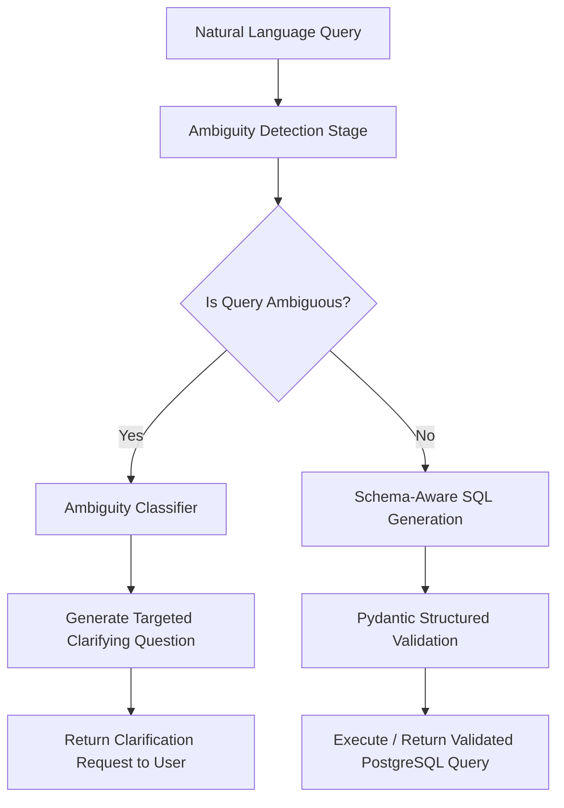

# Ambiguity-Aware Text-to-SQL Engine with Proactive Clarification

[](https://www.python.org/)
[](https://docs.pydantic.dev/)
[](https://build.nvidia.com/)
[](https://www.postgresql.org/)

> **A production-grade Text-to-SQL pipeline that detects ambiguous queries before generating SQL — cutting the baseline silent wrong-guess rate from 100% to 0% with 96.2% overall accuracy and 100% precision.**

---

## Executive Summary & Benchmark Results

Standard Text-to-SQL systems suffer from **silent hallucinated assumptions**: when asked *"Who is our best customer?"*, they silently invent a metric (revenue vs. order volume vs. recency) without alerting the user.

This engine introduces an upstream **Ambiguity Classification & Clarification Layer** backed by Pydantic structured schemas that intercepts under-specified questions, formulates targeted clarifying questions, and only executes deterministic SQL.

### Benchmark Performance (26 Labeled Test Cases)

Evaluated against a balanced suite of 26 e-commerce database queries (including adversarial edge cases like unanchored time windows, column collisions, and domain-standard calculations):

| Metric | Baseline (Direct SQL) | Zero-Shot Clarification | **Targeted Few-Shot Engine (Ours)** |
| :--- | :---: | :---: | :---: |
| **Overall Accuracy** | — | 88.5% (23/26) | **96.2% (25/26)** |
| **Precision** | — | 84.6% | **100.0% (Zero False Positives)** |
| **Recall** | — | 91.7% | **91.7% (11/12 ambiguous caught)** |
| **False Positives** (unnecessary prompts) | — | 2 | **0 (Zero User Fatigue)** |
| **Silent Wrong-Guess Rate** | **100.0% (12/12)** | **0.0%** | **0.0% (Eliminated)** |

```
                       SILENT GUESS FAILURE RATE
Baseline (Direct SQL)  ██████████████████████████████ 100%
Our Engine             ░░░░░░░░░░░░░░░░░░░░░░░░░░░░░░ 0%
```

---

## Architecture & Pipeline Flow



### Ambiguity Taxonomy Handled

1. **Undefined Superlatives (`undefined_superlative`)**: Queries like *"top product"* or *"best customer"* lacking explicit ranking criteria (revenue, unit volume, frequency).
2. **Missing Time Ranges (`missing_time_range`)**: Relative temporal terms like *"recent orders"*, *"trending"*, or *"lately"* without explicit anchor dates.
3. **Column Collisions (`column_collision`)**: Entity terms like *"name"* or *"sales"* that exist across multiple schema tables (`customers.name` vs. `products.name` vs. `categories.name`).
4. **Undefined Aggregations (`undefined_aggregation`)**: High-level metrics like *"sales"* where volume count vs. currency sum are both valid interpretations.

---

## Relational Schema Design

The engine operates over a normalized 5-table PostgreSQL e-commerce schema with explicit entity relations and realistic column naming collisions:

```
 customers(customer_id, name, email, signup_date, region)
 categories(category_id, name)
 products(product_id, name, category_id -> categories, price, cost)
 orders(order_id, customer_id -> customers, order_date, status)
 order_items(order_item_id, order_id -> orders, product_id -> products, quantity, unit_price)
```

---

## Repository Structure

```
├── app/
│   ├── __init__.py          # Core package exports
│   ├── models.py            # Pydantic schemas (AmbiguityCheck, SQLGeneration, PipelineResult)
│   ├── prompts.py           # System prompts, schema injection & few-shot ambiguity rules
│   └── pipeline.py          # Rate-limited inference engine (40 RPM) & retry backoff
├── eval/
│   ├── __init__.py          # Evaluation package
│   ├── eval_set.json        # 26 labeled test cases (13 ambiguous, 13 unambiguous)
│   └── run_eval.py          # Benchmark harness scoring precision, recall & silent-guess rate
├── schema.sql               # PostgreSQL schema definition with indexes & constraints
├── requirements.txt         # Production dependencies
├── WRITEUP.md               # Detailed evaluation report & failure analysis
└── README.md
```

---

## Quickstart & Usage

### 1. Installation

```bash
# Clone the repository
git clone https://github.com/vishalmurugan1986/ambiguity-aware-text2sql.git
cd ambiguity-aware-text2sql

# Install dependencies
pip install -r requirements.txt
```

### 2. Environment Configuration

Create a `.env` file or export your NVIDIA API key:

```bash
export NVIDIA_API_KEY="nvapi-your-key-here"
```

### 3. Programmatic Usage

```python
from app.pipeline import run_pipeline

# Example 1: Ambiguous Question -> Returns Clarification
result = run_pipeline("Who is our best customer?", with_clarification=True)
print(result.clarification_asked)  # True
print(result.ambiguity_check.clarifying_question)
# -> "What criteria should be used to determine the 'best' customer, such as total revenue, number of orders, or recency?"

# Example 2: Unambiguous Question -> Returns Production SQL
result = run_pipeline("List all customers who signed up in 2024.", with_clarification=True)
print(result.final_sql)
# -> "SELECT * FROM customers WHERE EXTRACT(YEAR FROM signup_date) = 2024"
```

### 4. Running the Benchmark Suite

Run the full evaluation harness to verify metrics against `eval_set.json`:

```bash
python -m eval.run_eval
```

Results are saved to `eval/results.json` and summarized in the terminal.

---

## Production Engineering Highlights

- **Pydantic Type Enforcement**: LLM completions are strictly parsed into validated Pydantic models (`AmbiguityCheck`, `SQLGeneration`, `PipelineResult`) preventing malformed outputs.
- **Adaptive JSON Recovery**: Built-in markdown fence stripping and outer-bracket regex extractors ensure robustness against varying LLM formatting quirks.
- **API Rate Control & Backoff**: Built-in request pacing and exponential backoff retry handler strictly respecting API quotas (e.g. 40 RPM limits).
- **Zero-Interruption Tuning**: Tuned prompt bounds ensure domain formulas (`margin = price - cost`) and explicit anchor dates (`...from 2024-06-01`) are never falsely flagged as ambiguous.
